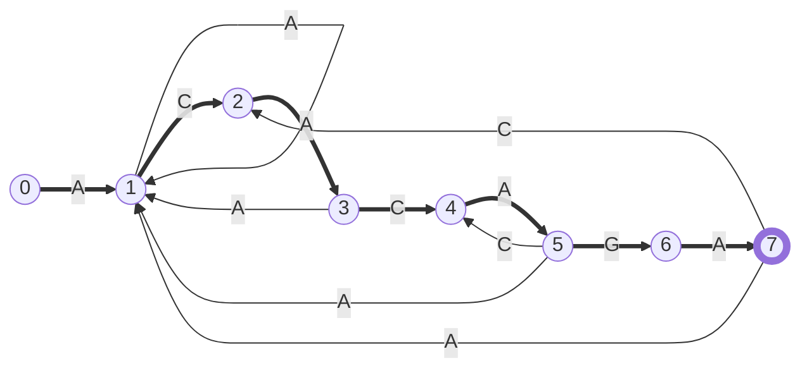
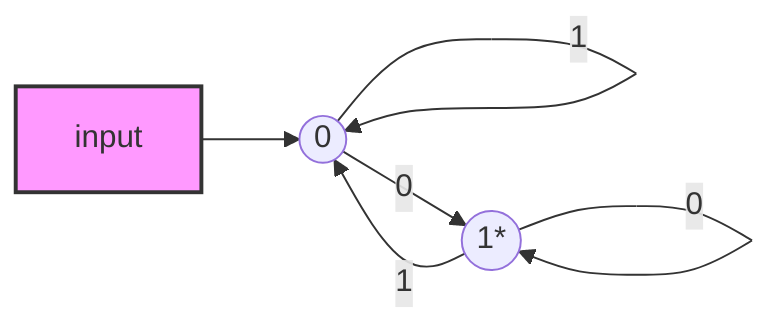
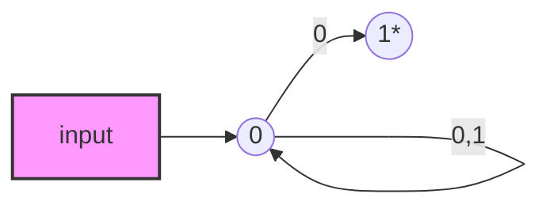

## 有限状态机（FSM，Finite State Machine）

?	有限状态机是一种用来进行对象行为建模的工具，其作用是描述对象在它的生命周期内所经历的状态序列，以及如何响应来自外界的各种事件。计算机科学中，有限状态机被广泛应用于建模应用行为、软件工程、编译器、网络协议和计算与语言的研究。下图是有名的TCP协议状态机。


?	通常我们在编程中用到的if/else、switch/case语句就是在和有限状态机打交道。在处理一些业务逻辑比较复杂的需求时，可以看看是否符合用一个有限状态机来描述，如果把一些业务模型抽象成一个有限状态机那么代码逻辑就会非常清、晰结构规整。  

### 1、状态机的要素

状态机可以归纳为4个要素：现态、条件、动作、次态，其中“现态”和“条件”是因，“动作”和“次态”为果。

- 现态：当前所处的状态。
- 条件：又称为事件，当一个条件被满足，将会触发一个动作，或者执行一次状态的迁移。
- 动作：条件被满足后执行的动作，动作执行完成后，可以迁移到新的状态，也可以仍然保持原状态；动作不是必须的，当条件被满足后也可以不执行动作直接迁移到新状态。
- 次态：条件被满足后要迁往的状态，次态是相对于现态的，次态一旦被激活就变为现态；


###2、范例 基于FA（Finite Automata）的字符搜索

?	问题：对于搜索模式$pat =  "ACACAGA"$，s如何构建状态机？

?	搜索模式长度为M=7，则FA的状态数为M+1 = 8，构建状态机的关键是对于当前状态以及任何输入字符如何得到下一个状态？设给定任意字符为x，当前状态为k，那么下一个状态对应的字符串为$P  = "pat[0..k-1]x"$（该字符串为搜索 模式的前k个字符与输入字符x构成），==方法是：找到$P$的最长前缀 后缀的长度d，这个长度d就是下一个要跳转的状态== ，例如 ：$k = 5, x = 'C'$，则$P = pat[0..4]x = "ACACAC"$，则其最长前缀后缀字符串为"ACAC"，长度d=4，那么对于$k = 5, x = 'C'$ ，下一个状态是4。下图是对于模式 pat="ACACAGA"的状态机和转换表:



| 现态/输入 |      |      |      |      |
| :---: | :--: | :--: | :--: | :--: |
| state |  A   |  C   |  G   |  T   |
|   0   |  1   |  0   |  0   |  0   |
|   1   |  1   |  2   |  0   |  0   |
|   2   |  3   |  0   |  0   |  0   |
|   3   |  1   |  4   |  0   |  0   |
|   4   |  5   |  0   |  0   |  0   |
|   5   |  1   |  4   |  6   |  0   |
|   6   |  7   |  0   |  0   |  0   |
|   7   |  1   |  2   |  0   |  0   |

?	实现上述状态表最简单的方法是对于任意 给定 状态k和输入字符x，得到字符串P = “pat[0..k-1]x”，遍历P中所有可能成为P后缀的前缀，从中找出最长的前缀长度即为下一个状态，算法的时间复杂度为$O(m^3*NO\_OF\_CHARS)$其中 m为搜索模式的长度，NO_OF_CHARS为搜索模式和 文本中所有可能的字符个数。使用KMP中 请求最长前缀后缀长度的的算法可以将算法复杂度降低到$O(m * NO\_OF\_CHARS)$


s


## WiKi
1. 避免把某个“程序动作”当作是一种“状态”来处理，如何区分“动作”和“状态”？“动态”是不稳定的，即使没有条件触发，“动作”一旦执行完毕就结束了；而“状态”相对稳定，如果没有外部条件的触发，一个状态就会一直持续下去。

2. 状态划分时漏掉一些状态，导致跳转逻辑不完整。所以维护一张状态表 就非常有必要，从表中可以直观看出哪些状态存在，跳转路径是什么。如果状态不存在，表格中对应的单元格就为空。写好代码后可以根据这张表进行review，QA也可以 根据这个做测试。

3. 状态跳转逻辑的两种写法：状态中判断事件、事件中判断状态。一般业务场景来说，状态的数量是确定的且较少，不同状态下需要处理的事件也不一样；而触发的事件数量则比较多，采用第二种的优势是可以使用switch/case语句剥离为单独的处理逻辑。


## FA(Finite Automata)

FA的基本构成如下，有限机的数据表达式为：{Q, $∑$,  q, F, $ δ$}。FA分为两类：DFA(Deterministic Finite Automata)、NFA(Nondeterministic Finite Automata)

```
Q: Finite set of states
∑: set of input symbols
q: Initial state
F: set of final states
δ: transition function
```

### 1、有限确定状态机DFA

?	在DFA中，对某一特定输入字符，状态机 只能进行一次状态的改变。状态转移函数F定义了在每一个状态 下 ，输入某一符号 后状态如何转移。注意的是：在DFA中，不移动是不允许存在的，输入为空是不能改变状态的。例如：下图 是$∑={0, 1}$ 的有限状态机，该状态机的含义是接受所有二进制 字符串中以0结尾的字符串，最后若输入序列状态为1说明是以‘0’结尾。==注意== ：同一个pattern可能会对应多个DFA，通常情况下取状态数目 最小的有限状态机。



###2、有限不确定状态机NFA

与DFA不同的是NFA满足以下特性：

- null (or $ε$ ) move是允许的，再不输入符号的情况下也可以改变状态；
- 对于一个特定输入自动机能够改变任意数量个状态；

然而即使有上述两个 特性，NFA与DFA相比，没有什么优势，实际上两者功能是等价的。NFA的数学表达式与DFA的不同是在状态转换函数上$ δ$,有下图状态转换函数可以知道，对于任意 输入（包括 null or &epsilon）NFA能够进行任意数目的状态转换。

```
Q: Finite set of states
∑: set of input symbols
q: Initial state
F: set of final states
δ: transition function
δ：Q X (∑ U ?) --> 2 ^ Q
```

例如：状态机的含义是接受所有二进制 字符串中以0结尾的字符串，，最后若输入序列状态为1说明是以‘0’结尾，$∑={0, 1}?$的NFA如下图 所示



### 总结

1. 每一个DFA都是一个NFA，反之不成立；
2. DFA和NFA的功能是 一样的，每一个NFA都可以转换为DFA；
3. 在 DFA和NFA中最终的状态数可能有多个；
4. NFA更多是理论上 的概念；
5. DFA用于编辑器中的词法分析；