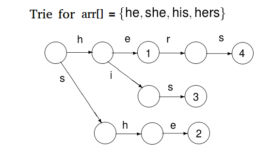
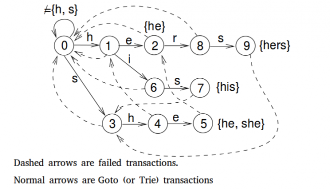

## String Match
问题描述: 对于给你定字符串S[0..n]和P[0..m]，满足条件 m<n，求出所有S中与P相等的子串。

### Naive Method
最简单的字符串匹配算法就是采用遍历，即将字符串P从S的开始出逐一对比，直到找到能够匹配的子串或查找失败，经过优化后的算法时间复杂度为O(m*(n-m+1))。

算法的缺点是：当P匹配了前面大多数字符串时，在最后出现了一个不匹配的情况，这时算法的效率最低，例如：

``` 
    S = "ABABABABABABAABABAC"
    P = "ABABAC" (a bad case for Naive Method)
```

### KMP Pattern Search
> Degenerating Property: pattern having same sub-patterns appearing more than once in the pattern.

KMP(Knuth Morris Pratt)算法利用Pattern的退化特性，即一个模式中同一子模式出现不止一次，使得在最坏情况下的时间复杂度提高为O(N)。KMP的**基本思想**是：当匹配过程中出现不匹配时，那么我们就知道在下一个窗口中进行匹配时能够匹配的字符串，在进行下一次匹配时我们就直接跳过这些已匹配的字符串。

```
[Match Overview]

        S = "AAAAABAAABA"
        P = "AAAA"
        
[step 1] 
        S = "AAAA ABAAABA"
        P = "AAAA"         初始位置，匹配
[step 2]
        S = "AAAA A BAAABA"
        P =  "AAA A"
在当前窗口进行匹配时，仅仅比较模式的第四个字符来判断字符串是否匹配模式，这就是KMP优化的地方，因为我们已经提前知道前三个字符串一定匹配，那么在比较是直接跳过这三个字符，从第四个字符开始比较。

[预处理]
从上面step 2可以看出，在匹配时如何知道前三个字符是已匹配的呢？因此在匹配之前需要对模式进行预处理，通过数组lps[]记录每一步匹配时，需要跳过的字符数。
```

#### KMP的预处理
KMP算法需要对模式Pattern进行预处理，预处理结果是一个数组，大小为模式字符串的长度，用于存储在每一次匹配时直接跳过比较字符串的个数。

lps表示模式的proper prefix(不包括字符串本身)也是该模式suffix(包括字符串本身)，或者lps表示为模式的prefix也该模式是proper suffix，例如：

``` 
    P = "ABC"
    proper prefix: "A"  "AB"
    suffix : "C" "BC" "ABC"
```

对于任意模式P[0..i]，0 <= i <= m，lps[i]用于存储所有P[0..i]的proper prefix也是P[0..i]的suffix中最长proper prefix的长度。

``` 
    P = "AAAA"
    lps = [0, 1, 2, 3]
    
    P = "AABAACAABAA"
    lps = [0, 1, 0, 1, 2, 0, 1, 2, 3, 4, 5]

[预处理算法]
    对于P[0..m]， P[0..i]表示当前处理的子串，用于len表示P[0..i-1]中logest prefix suffix的子串长度。
    lps[i]表示P[0..i]中longest prefix suffix的子串长度
    
             { len + 1    if P[len] = P[i] <------------------------------|
    lps[i] = {                                                            |
             {            else if len != 0 update len=lps[len-1], then recursive 
             {
             { len        else len = 0
             
    初始条件：lps[0] = 0 因为长度为1的字符串不存在proper prefix
             i = 1 len = 0

```

#### 使用lps进行搜索
在使用KMP进行字符串比较时，我们就不需要每一次比较所有的字符是否相等，而是通过lps决定这一次要进行比较的字符的位置(跳过那些已经确定会匹配的字符串)。那么应该如何通过lps决定要进行比较的字符的位置或者说要跳过多少字符串再进行比较？

- 从开始(i=0, j=0)进行匹配，若S[i]=P[j]匹配，则(i++, j++)自增1，进行下一次比较；
- 当出现S[i]!=P[j]时，我们知道子串P[0..j-1]与子串S[i-j+1..i-1]是匹配的，同时我们知道lps[j-1]为子串P[0..j-1]中的proper prefix和suffix的最长长度。从上述两点，可以知道：在S[i-j+1..i-1]的子串中，有lps[j-1]个字符是不需要比较的，因为它们是匹配的。

``` 
          S = "AAAAABAAAA"
          P = "AAAA"
          lps = {0, 1, 2, 3}
[匹配流程]
          i = 0, j = 0   S[i]=P[j] i, j 自增1
          i = 1, j = 1   S[i]=P[j] i, j 自增1
          i = 2, j = 2   S[i]=P[j] i, j 自增1
          i = 3, j = 3   S[i]=P[j] i, j 自增1
          i = 4, j = 4   j = M, 模式找到， 重置j = lps[j-1] = lps[3] = 3
          i = 4, j = 3   S[i]=P[j] i, j 自增1
          i = 5, j = 4   j = M, 模式找到， 重置j = lps[j-1] = lps[3] = 3
          i = 5, j = 3   S[i]!=P[j], 重置j = lps[j-1]=lps[2] = 2
          i = 5, j = 2   S[i]!=P[j], 重置j = lps[j-1]=lps[1] = 1
          i = 5, j = 1   S[i]!=P[j], 重置j = lps[j-1]=lps[0] = 0
          i = 5, j = 0   S[i]!=P[j] && j ==0, 重置i = i + 1
          i = 6, j = 0   ....

```

### Rabin-Karp Pattern Search

基本的模式匹配算法Naive Method是通过每一次滑动一个字符后，然后在当前窗口，一个个比较模式中的字符，若完全匹配则成功。Rabin-Karp搜索算法同Naive Method算法一样，也是需要每一次滑动一个字符，不同的是在当前窗口不是一个一个比较字符，而是比较当前窗口的字符串长度为M(模式字符串的长度)的子串与模式Pattern的哈希值是否相同，若相同则匹配成功。Rabin-Karp算法需要计算下面字符串的哈希值：

 - 模式自身的哈希值；
 - 要匹配字符串中所有长度为M的子串的哈希值；
 
#### 如何计算哈希值

为了能够高效的计算字符串的哈希值，我们希望能够根据当前窗口中的子串的哈希值和下一窗口中新增的字符高效的计算出下一窗口中子串的哈希值，公式推导如下：

```
    假设当前窗口的子串为：S[s..s+m-1]，其哈希值为hash(S[s..s+m-1])，下一窗口的子串为：S[s+1..s+m]，则有：
        hash(S[s+1..s+m]) = rehash(hash(S[s..s+m-1]), S[s+m])
    要求rehash操作的时间复杂度为：O(1)
    
    为了保证计算的hash值能够用整型存放，在计算哈希值时，需要使用取模操作计算哈希值
    对于P[0..m-1]，其hash值的计算公式为：
       初始条件：p = 0
       p = (d * p + s.charAt(i)) % q  0 <= i <= m-1
    rehash函数的表达式为：
       hash(S[s+1..s+m]) = (d * ( hash(S[s..s+m-1]) - S[s]*h ) + S[s+m] ) % q
       d: 字母表中字符的数目
       q: 一个素数
       h: d^(m-1)   
``` 

#### 算法时间复杂度分析

Rabin-Karp算法的平均和最好时间复杂度为O(N+M)，但是最坏情况下的时间复杂度为O(N*M)，最坏情况是所有模式中的字符都一样且与要匹配的字符串中的所有字符一样，这样所有子串的哈希值与模式中的哈希值相同，因此算法就退化为逐一进行比较。例如: S="AAAAAAA"  P="AAAA"

### Z's Algorithm

__定义__：Z数组的长度与要匹配的字符串txt[0..n-1]长度一样，元素Z[i]的值表示从字符串txt[i]开始的子串中是字符串txt[0..n-1]的最长前缀的长度。Z数组的第一元素值没有意义，因为字符串本身就是自己的最长前缀。

```
   范例:
     Index  0  1  2  3  4  5  6  7  8  9  10  11
     Txt    a  a  b  c  a  a  b  x  a  a  a   z   
     Z数组  x  1  0  0  3  1  0  0  2  2  1   0
```

#### 如何使用Z数组实现模式匹配

对于字符串S以及模式P，将其拼接为"P$S"的字符串，其中P为模式，S为要匹配的字符串，'$'为既不在S中也不再P中存在的字符。对于构建的字符串"P$S",建立Z数组，对于Z数组中元素值与模式P的长度一直的位置，就是模式匹配的位置。

``` 
    范例:
      P = "aab"   S = "baabaa"
      constructed_S = "aab$baabaa"
      Z数组的值为：{x, 1, 0, 0, 0, 3, 1, 0, 2, 1}
      那么匹配的位置为：(5-4)=1
```

#### 如何构建Z数组

最简单的方法就是通过两层循环，每一次内部循环计算一次对应位置的最长前缀长度，时间复杂度为O(N^2)。有一种计算Z数组的线性方法，[算法演示](http://www.utdallas.edu/~besp/demo/John2010/z-algorithm.htm)。

__Z Box__: 由[L, R]表示，是当前最长前缀子串的范围，L、R表示Z Box的左右边界，初始值为[0, 0];

``` 
[计算Z数组的算法]
    1. 初始值[L,R] = [0,0], i=1(Z[0]是无意义的值);
    2. 当i > R时，则最长前缀子串的范围中不包括i, 需要重置L，R的值，然后通过比较txt[0..] 与 txt[i..]计算L，R的值，最后设置Z[i] = R-L+1；
       例如：当[5,7]且i = 8时，计算后的结果为 [8, 9] Z[8] = 2
            Z'Box                [5     7] 
            Index                          8 
            txt    a  a  b  $  b  a  a  b  a  a        
    3. 当i <= R时，令K = i - L，则有 Z[K] >= min{Z[k], R-i+1} 因为从txt[i]开始的子串至少会与R-i+1个字符相等(可能会更多)，因此有两种情况。
       a). 若Z[k] < R-i+1，即从txt[i]开始的子串，与前缀最多也就R-i+1的相等。
           此时，txt[R]不会再有更长前缀了，不需要扩展Z's Box的范围，因此Z[i] = Z[k], Z's Box： [L, R]保持不变。
       
       b). 若Z[k] >= R-i+1，则表示从txt[i]开始的子串，与前缀至少有R-i+1个相等，此时已经超过[L,R]所表示的范围。
           此时，说明需要扩展Z's Box范围，重置L=i, R从i开始，若txt[0..]与txt[i..]，则R就自增1，直到出现不匹配字符，设置Z[i] = R-i+1。
[范例]  P = "aab"  S = "baabaa"  构建的字符串cs="aab$baabaa"，则Z数组的计算结果如下：

     初始化：i = 1, R = 0, L = 0
     【i = 1】
        i > R，需重新计算[L,R]，比较Txt[0..N] 与 Txt[1..N]，Txt[0]==Txt[1]则有 L = 1，R = 1，Z[1] = R - L + 1 = 1
        Index:      0   1   2   3   4   5   6   7   8   9
        Txt:        a   a   b   $   b   a   a   b   a   a
        Z values:       1
     【i = 2】
        i > R，需重新计算[L,R]，比较Txt[0..N] 与 Txt[2..N]，Txt[0]!=Txt[2]则 Z[2] = 0，L = 1，R = 1保持不变
        Index:      0   1   2   3   4   5   6   7   8   9
        Txt:        a   a   b   $   b   a   a   b   a   a
        Z values:       1   0
     【i = 3】
        i > R，需重新计算[L,R]，比较Txt[0..N] 与 Txt[3..N]，Txt[0]!=Txt[3]则 Z[3] = 0，L = 1，R = 1保持不变
        Index:      0   1   2   3   4   5   6   7   8   9
        Txt:        a   a   b   $   b   a   a   b   a   a
        Z values:       1   0   0
     【i = 4】
        i > R，需重新计算[L,R]，比较Txt[0..N] 与 Txt[4..N]，Txt[0]!=Txt[4]则 Z[4] = 0，L = 1，R = 1保持不变
        Index:      0   1   2   3   4   5   6   7   8   9
        Txt:        a   a   b   $   b   a   a   b   a   a
        Z values:       1   0   0   0     
     【i = 5】
        i > R，需重新计算[L,R]，比较Txt[0..N] 与 Txt[5..N]，Txt[0]==Txt[5]则 L = 5，R = 5
                                                          Txt[1]==Txt[6]则 R = 6
                                                          Txt[2]==Txt[7]则 R = 7
                                                          Z[5] = 7 - 5 + 1 = 3
        Index:      0   1   2   3   4   5   6   7   8   9
        Txt:        a   a   b   $   b   a   a   b   a   a
        Z values:       1   0   0   0   3
     【i = 6】
        i <= R，K = i - L= 6 - 5 = 1，有Z[K] = Z[1] = 1
           因为Z[K] < R-i+1=2， 则Z[6] = Z[K] = Z[1] = 1，L，R保持不变；
        Index:      0   1   2   3   4   5   6   7   8   9
        Txt:        a   a   b   $   b   a   a   b   a   a
        Z values:       1   0   0   0   3   1
     【i = 7】
        i <= R，K = i - L = 7 - 5 = 2，有Z[K] = Z[2] = 0
           因为Z[K] < R-i+1=1，则Z[7] = Z[K] = Z[2] = 0，L，R保持不变；
        Index:      0   1   2   3   4   5   6   7   8   9
        Txt:        a   a   b   $   b   a   a   b   a   a
        Z values:       1   0   0   0   3   1   0                    
     【i = 8】
        i > R，需重新计算[L,R]，比较Txt[0..N] 与 Txt[8..N]，Txt[0]==Txt[8]则 L = 8，R = 8
                                                          Txt[1]==Txt[9]则 R = 9
                                                          Z[8] = 9 - 8 + 1 = 2
        Index:      0   1   2   3   4   5   6   7   8   9
        Txt:        a   a   b   $   b   a   a   b   a   a
        Z values:       1   0   0   0   3   1   0   2   
     【i = 9】
        i <= R，K = i - L = 1，有Z[K] = Z[1] = 1
           因为Z[k] >= R-i+1=1，则需要重新计算，比较Txt[0..N] 与 Txt[9..N]，Txt[0]==Txt[9]则 L = 9，R = 9
                                                                         Z[9] = 9 - 9 + 1 = 1
        Index:      0   1   2   3   4   5   6   7   8   9
        Txt:        a   a   b   $   b   a   a   b   a   a
        Z values:       1   0   0   0   3   1   0   2   1
```

### Aho-Corasick Algorithm（AC算法，多模式匹配算法）

问题描述：输入为一段文本Txt长度为N，以及有若干单词构成的一个数字W[K]，查找所有W[K]中的单词在Txt中出现的位置。

适用场景：在大量文本中查找许多单词或短语。

``` 
  范例
    输入：txt    = "ahishers"
         arr[]  =  {"he", "she", "hers", "his"}
         
    输出：
         his  出现位置 [1, 3]
         he   出现位置 [4, 5]
         she  出现位置 [3, 5]
         hers 出现位置 [4, 7]
```

令 M = m = length(arr[0]) + length(arr[1]) + .. + O(length(arr[k-1])，则若使用KMP算法每一个单词进行查找，则算法的时间复杂度为：O(N + length(W[0])) + O(N + length(W[1])) + .. + O(N + length(W[K-1]))，即算法时间复杂度为O(N*K + M)。而 **Aho-Corasick算法** 能够在O(N + M + Z)时间内找出所有单词的出现位置，其中Z表示数组中的单词在文本中的出现的总次数。

PS：Aho-Corasick算法是实现Unix fgrep命令的基础。

使用Aho-Corasick算法需要三步：

1.建立模式的Trie，Trie树也是一种自动机。



2.BFS遍历给Trie添加失败路径。构建方法：设当前节点A，沿着A的父亲节点的失败指针遍历，直到走到一个节点B，B的孩子中也有字母为A的节点，则把A的失败指针指向B；若走到了root都没有找到，则把失败指针指向root。特殊情况：第二层的节点的失败指针直接指向root节点。



3.根据AC自动机，搜索待处理的文本。从root节点开始，每次根据读入的字符沿着自动机向下移动，当读入的字符在分支中不存在时，沿着失败路径递归，若沿着失败路径走到了root，则跳过该字符处理下一个。因为AC自动机是沿着输入文本的最长前缀移动的，所以在读取完所有输入文本后，最后递归沿着失败路径，直到达到根节点，这样确保所有模式能够被检测出。

``` 
  预处理：根据提供的pattern数组，构建自动机，该自动机主要有三个功能。
  Go To:   通过所有pattern数组构建TTrie树，用g[][]表示该功能，g[i][c]表示当前状态i，字符为c的下一个的状态；
  Failure：若当前字符在Trie树中没有边存在，用f[]存放当前状态的下一个状态；
  Output:  存放所有单词中在当前状态结束的索引，用o[]存放所有匹配的单词索引构成的bitmap；
  
  
```
